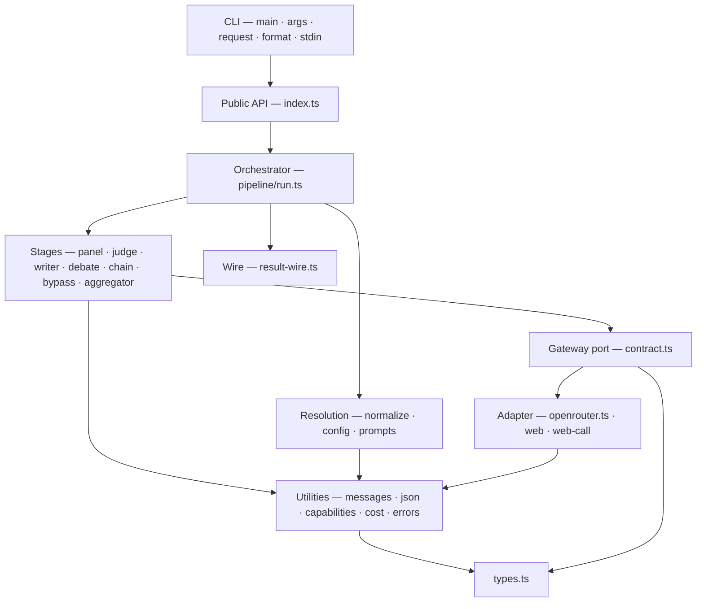
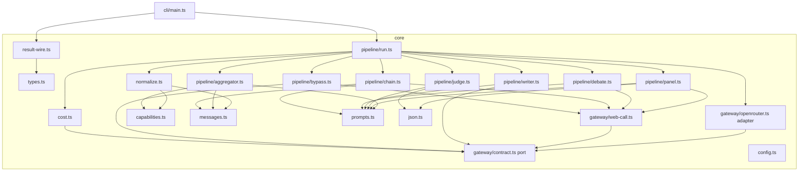
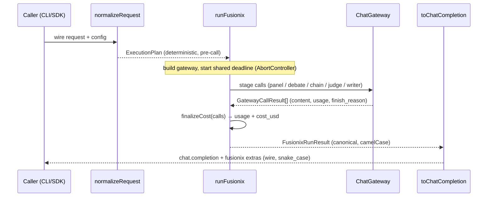
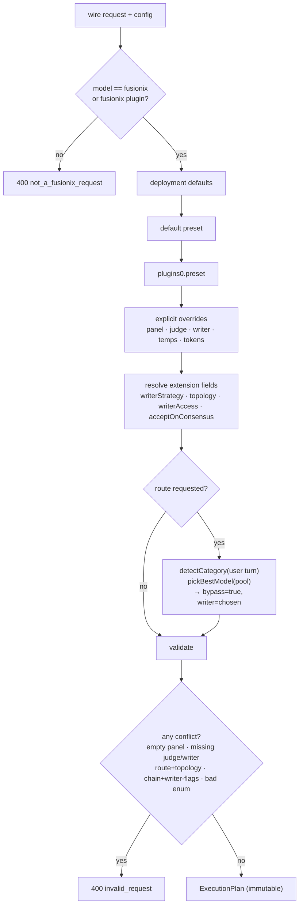
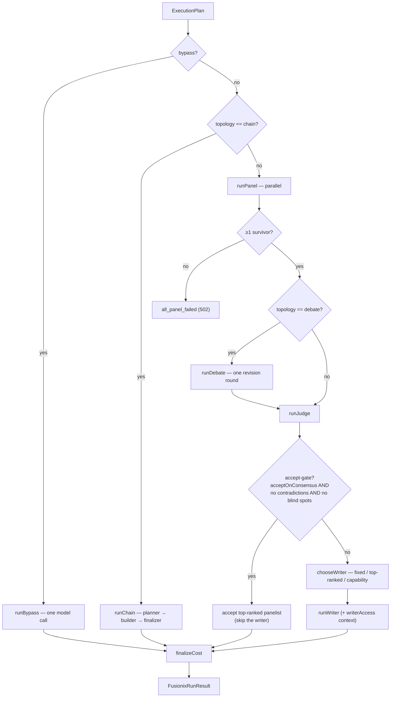
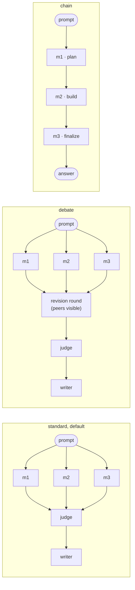
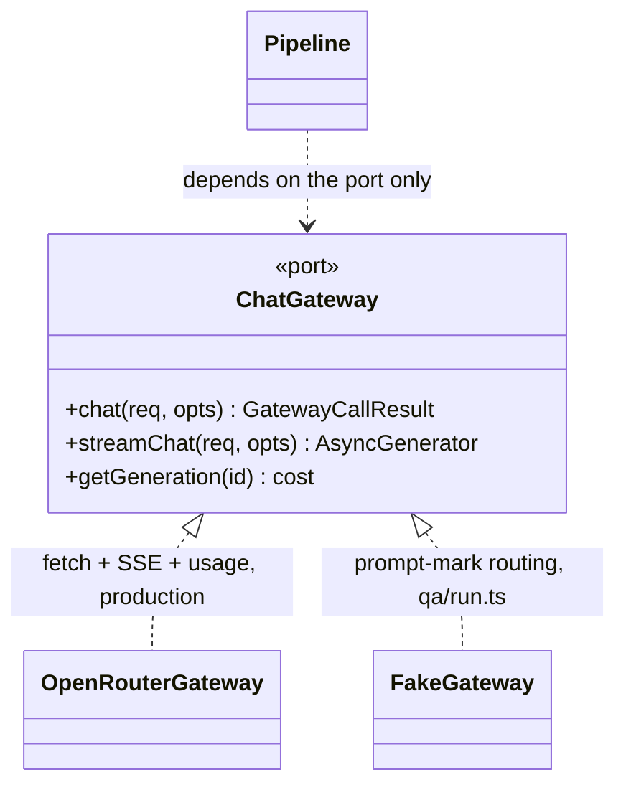
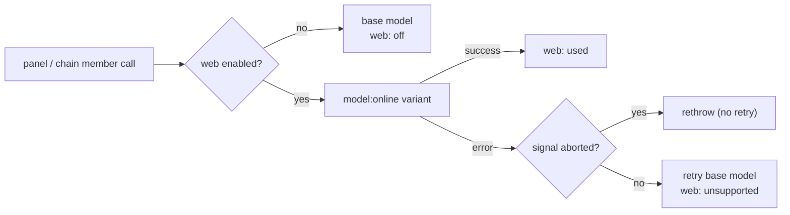
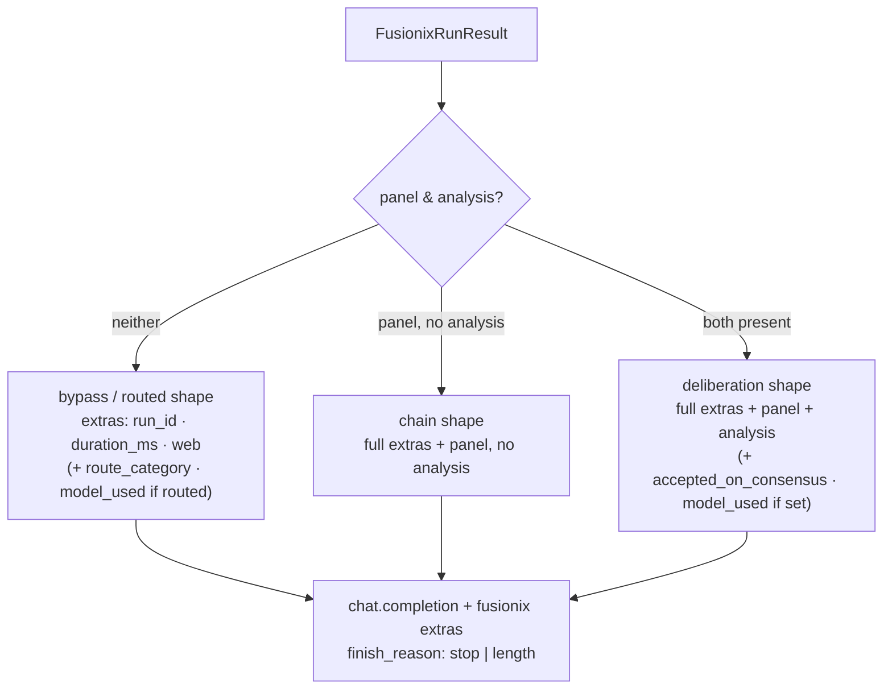

# Fusionix — Architecture

**An OpenRouter-shaped multi-model deliberation engine.**

Status: describes the implementation on `main` (Phase 1 core + CLI, with the v0.9 and v0.10 extensions). Companion to the behavioural spec in [`../fusionix-spec.md`](../fusionix-spec.md) and the extension design notes in [`design/fugu-extensions.md`](design/fugu-extensions.md).

---

## 1. Abstract

Fusionix takes a prompt, sends it to several models in parallel (the **panel**), asks a **judge** model to compare their answers into structured JSON, and asks a **writer** model to synthesise one final answer. It is exposed behind a single OpenAI-compatible interface: a client pointed at it with `model: "fusionix"` gets the synthesised answer in `choices[0].message.content`, while the panel answers and judge analysis ride in a non-standard `fusionix` extras field.

The system is a **deterministic, zero-runtime-dependency TypeScript monorepo** with no training loop. Every routing and selection decision is resolved into an immutable execution plan *before* any model is called, the gateway is reached through a port/adapter boundary, and a family of opt-in coordination controls (routing, adaptive aggregation, debate and chain topologies, a verifier accept-gate) layer on top of the base pipeline without changing its default behaviour.

---

## 2. Design principles & invariants

These are load-bearing; the rest of the architecture follows from them.

1. **Deterministic, resolved pre-call.** `normalizeRequest` turns a wire request + config into a single `ExecutionPlan` before any gateway call, so the CLI, SDK, and (future) hosted API behave identically. The *only* decision taken from live model output is which model writes the final answer under an adaptive strategy — and that is a pure function of the judge's analysis at a fixed seam in the orchestrator.
2. **Off by default at the pipeline level.** With no extension flag set, the run is exactly the base `panel → judge → writer` (or single-model bypass). New capabilities are opt-in and resolved into plan fields that the default path never sets. (One deliberate exception: the writer's "resolve disagreements" instruction is an always-on v0.9 product change to the §14.3 prompt; the judge prompt is unchanged unless a feature that maps its ranking to a model is active.)
3. **Zero ML.** Fusionix is the hand-designed scaffold, not a learned orchestrator. All "intelligence" is heuristic and inspectable: a static capability prior, keyword category detection, and deterministic predicates over the judge's structured output.
4. **Zero runtime dependencies.** Node-native throughout — `fetch`, `node:util` `parseArgs`, the built-in test runner, and native TypeScript execution via `--conditions=development`. Only `typescript` and `@types/node` are needed to build.
5. **Ports and adapters.** The pipeline depends on a narrow `ChatGateway` abstraction, never on OpenRouter directly. The adapter is one file and is injectable, which is what makes the entire pipeline testable offline.
6. **Behaviour lives in core.** `@ikangai/fusionix-core` holds all logic; the CLI is a thin, fully-injectable shell. The same core is intended to power the SDK and hosted API, so all surfaces stay consistent.

---

## 3. Package & module layout

```
packages/
├── core/   @ikangai/fusionix-core   — all pipeline, normalization, cost, gateway, result logic (~2.8k LoC)
└── cli/    @ikangai/fusionix-cli    — thin terminal wrapper (--local mode in Phase 1)
```

Core modules, grouped by role:

| Layer | Modules | Responsibility |
|---|---|---|
| **Types & errors** | `types.ts`, `errors.ts` | Shared wire/plan/result types; `FusionixError` + code→HTTP-status map. |
| **Leaf utilities** | `messages.ts`, `json.ts`, `capabilities.ts`, `util.ts` | Role folding & compact prompts; robust JSON extraction; capability prior + category detection; ids. |
| **Gateway (port/adapter)** | `gateway/contract.ts`, `gateway/openrouter.ts`, `gateway/web.ts`, `gateway/web-call.ts` | The `ChatGateway` port; the OpenRouter adapter; `:online` web variant + fallback. |
| **Resolution** | `normalize.ts`, `config.ts`, `prompts.ts` | Request → `ExecutionPlan`; preset/config loading; prompt templates & renderers. |
| **Pipeline** | `pipeline/{run,panel,judge,writer,debate,chain,bypass,aggregator}.ts` | The orchestrator and the model-calling stages. |
| **Cost & output** | `cost.ts`, `result-wire.ts` | Usage aggregation + cost backfill; the OpenAI-compatible wire mapper. |
| **Public API** | `index.ts` | Curated re-exports for the CLI/SDK. |

CLI modules: `main.ts` (entry flow, injectable `MainDeps`), `args.ts` (`parseArgs`), `request.ts` (args → wire request), `format.ts` (md/text/json renderers), `stdin.ts`.

The dependency graph is strictly downward and acyclic. `types.ts` depends on nothing; the gateway port depends only on types; the pipeline stages depend on the port and the renderers; the orchestrator (`run.ts`) sits at the top and wires everything together.

At a glance, as layers (each depends only on those below):



And at module level:



---

## 4. The request lifecycle

A run proceeds in three phases: **resolve → execute → shape**.



Two type boundaries are kept deliberately separate: the **wire** request/response (OpenAI/OpenRouter shape, snake_case) and the **canonical** core result (`FusionixRunResult`, camelCase). `normalizeRequest` maps wire→plan on the way in; `toChatCompletion` (`result-wire.ts`) maps canonical→wire on the way out. The pipeline only ever sees canonical types.

---

## 5. Resolution — the ExecutionPlan

`normalizeRequest(request, config, opts) → ExecutionPlan` is the deterministic heart. Resolution order: deployment defaults → default preset → `plugins[0].preset` → explicit request overrides → routing → validation. Key mappings:

- top-level `model` is the **writer** (or, when it is the sentinel `"fusionix"`, the preset's writer); `plugins[0].model` is the **judge**; `plugins[0].analysis_models` (or the preset) is the **panel**.
- A request with a concrete model and *no* fusionix plugin is rejected `400 not_a_fusionix_request` — this is a deliberation engine, not a passthrough proxy.
- Presets are **data, not code** (`config/default.config.json`): they carry the model slugs, per-stage system prompts, temperature, and web default. Model slugs never appear in core logic.



The plan is an immutable record of *everything the run will do*: the three model slots, temperatures/token caps per stage, web flag, and the resolved extension fields (`writerStrategy`, `topology`, `writerAccess`, `acceptOnConsensus`, `routeCategory`, `bypass`). All validation — empty panel, missing judge/writer, unknown enum values, and the cross-feature conflicts (§7.4) — happens here, before a single token is spent.

---

## 6. The base pipeline

The orchestrator `runFusionix` (`pipeline/run.ts`) sets up a single shared **request deadline** — one `AbortController` with a hard `maxRequestDurationMs` timeout (default 180s) plus the caller's signal — and threads its `signal` into every gateway call, so a timeout or cancellation aborts all outstanding work at once.

```
                       ┌──────────── runFusionix (shared AbortController) ────────────┐
                       │                                                              │
 request ─► normalize ─┤  bypass? ───────────────────────────────► runBypass ──┐      │
                       │  topology=chain? ──────────────────────► runChain ─────┤      ├─► finalizeCost ─► result
                       │                                                        │      │
                       │  panel ─► [debate] ─► judge ─► accept-gate? ──yes──────┤      │
                       │                              └─ no ─► aggregator ─► writer    │
                       └──────────────────────────────────────────────────────────────┘
```

The same dispatch as a decision tree:



**Panel** (`panel.ts`, `runPanel`) sends the same role-folded messages to every panel model **in parallel** (`Promise.all`). It is partial-failure tolerant: a failed member stays in its resolved position as `{ model, error }`; a member that returns empty or unparseable content is handled gracefully (raw text is kept as the answer — no repair call). If *zero* members survive, the run fails `all_panel_failed`. Each member call goes through `chatWithWebFallback`, which tries the gateway's `:online` web variant when web is on and falls back to the base model on failure (reporting `web: "unsupported"`).

**Judge** (`judge.ts`, `runJudge`) sends the survivors to one model and parses structured JSON — `consensus`, `contradictions`, `partialCoverage`, `uniqueInsights`, `blindSpots`, `ranking`. It is the only stage with a repair path: exactly one reformat attempt at temperature 0 if the first output is not a JSON object, then `judge_failed`. Robust extraction lives in `json.ts` (fence-stripping, brace-matching, ReDoS-safe).

**Writer** (`writer.ts`, `runWriter`) synthesises the final answer from the prompt + the judge analysis (serialised JSON), optionally streaming deltas. The writer never uses web. Empty output → `writer_failed`.

**Bypass** (`bypass.ts`, `runBypass`) is the single-model path: no panel/judge, one call, trimmed extras. It is reached either explicitly (`enabled: false`) or via routing.

The model-calling stages share a deliberate shape — build messages, call through the gateway (with web where applicable), parse with `parsePanelContent`, collect the `GatewayCallResult` for costing. This duplication across `panel`/`debate`/`chain` is accepted in exchange for each stage staying a flat, independently-readable function.

---

## 7. Coordination extensions

All of these are opt-in and resolved in the plan. They are inspired by the Sakana **Fugu**, **Trinity**, and **Conductor** papers; the structural ideas were adopted, the training was not (see `design/fugu-extensions.md`).

### 7.1 Single-model routing (§22.4)
`route` picks the best-fit model from the pool via the **capability prior** + deterministic keyword **category detection** over the user turn, sets `bypass = true` and the chosen model as writer, and runs through bypass mechanics. Fully resolved in `normalize` — no live decision. Routed runs surface `route_category` + `model_used`.

### 7.2 Adaptive aggregator (§22.2)
`writerStrategy` chooses the writer per query at the judge→writer seam, from the *surviving* panel models: `top-ranked` uses the judge's #1, `capability` uses the prior for the detected category. This is the one place a model's output (the judge ranking) influences control flow, kept deterministic by `chooseWriter` being a pure function. To make `top-ranked`/judge-resolution reliable, a model-id ranking instruction is appended to the judge prompt — gated on *every* feature that reads the ranking (the aggregator, the accept-gate, and writer-access `judge+top`), so the default judge prompt is unchanged.

### 7.3 Verifier accept-gate (§23.1) & writer access-list (§23.3)
`acceptOnConsensus` (Trinity's Verifier-as-halt): when the judge reports no contradictions *and* no blind spots, accept the top-ranked surviving panelist's answer and **skip the writer** — one fewer call. An empty accepted answer falls through to the writer, so the run never returns empty content. `writerAccess` (Conductor's `access_list`, which is pure prompt-string selection, not tools): controls what the writer sees beyond the judge analysis — `judge` (default), `judge+panel`, or `judge+top`.

### 7.4 Topologies
`topology` reshapes the panel stage:
- **`debate`** (`debate.ts`): one inter-panel revision round before the judge — each surviving panelist sees the others' first answers and revises. Monotonic on the panel (a failed/empty revision keeps round-1) and mapped positionally so duplicate model slugs stay independent.
- **`chain`** (`chain.ts`): a self-contained sequential **planner → builder → finalizer** path. Panel models run in order, each seeing the accumulated work; the last step with content is the answer. There is no judge or writer stage, so chain needs no judge model.



These are mutually exclusive with the single-model path and with each other's stage-specific flags; `normalize` rejects the conflicting combinations (`route` + topology; `chain` + writer/judge-stage flags) with `invalid_request` rather than silently dropping one.

### 7.5 The capability prior (§22.6 / §23.2)
`capabilities.ts` is a small, hand-maintained map of provider/family → strength tags (GPT→math, Gemini→science/math/recall, Opus→coding/debugging/cybersecurity), reconciled with the papers' measured per-task winners and encoding *comparative advantage*, not global strength. `detectCategory` is a deterministic keyword scanner. Both are coarse heuristics — the deliberate, inspectable stand-in for what Fugu/Trinity learn.

---

## 8. Cross-cutting concerns

**Gateway port/adapter.** `ChatGateway` (`gateway/contract.ts`) is the whole surface the pipeline needs: `chat`, optional `streamChat`, optional `getGeneration` (cost backfill). `OpenRouterGateway` is the only adapter; it is constructed in `run.ts` but can be injected, which is the seam the offline test harness uses.



The `Pipeline` here is `panel · judge · writer · debate · chain · bypass` — none of them name `OpenRouterGateway`; they reach the model only through the port, which is what makes the offline `FakeGateway` a drop-in.

**Cost & usage (§8.1).** Every billable call (panel, debate, chain, judge, writer) is collected and passed to `cost.finalizeCost`, which backfills any missing per-call cost via `GET /generation` (best-effort) and aggregates tokens + `cost_usd`. `cost_usd` is `null` when the gateway reports no cost. `--max-cost` does a pre-flight estimate against a `GET /models` price table.

**Error model.** `FusionixError` (`errors.ts`) carries a stable code (`invalid_request`, `not_a_fusionix_request`, `all_panel_failed`, `judge_failed`, `writer_failed`, `gateway_error`, …) mapped to HTTP status, so the CLI exit codes and the future hosted API share one taxonomy.

**Web (§15).** Gateway-native only — the `:online` model variant with graceful fallback (`web: "used" | "off" | "unsupported"`). No custom tool loop.



**Result shaping.** `toChatCompletion` (`result-wire.ts`) is the single wire boundary. It classifies the result shape (`bypass = !panel && !analysis`), emits the OpenAI `chat.completion`, and attaches the `fusionix` extras — panel, analysis, `cost_usd`, web status, and the conditional markers `route_category` / `model_used` / `accepted_on_consensus`. `finish_reason` is threaded from the answering call (so a `max_tokens` truncation reports `"length"`, not `"stop"`).



---

## 9. The CLI surface

`packages/cli` is intentionally thin. `main.ts` takes a fully-injectable `MainDeps` (env, stdin, stdout/stderr, `runFusionix`, `loadConfig`, `loadPrices`, `appendFile`) so the whole flow is testable without a network or a TTY. The flow: parse args → validate flag enums → resolve the prompt (positional or stdin) → gate on `--local` + `OPENROUTER_API_KEY` → optional `--max-cost` pre-flight → run → render (`md`/`text`/`json`, default `md` on a TTY and `json` on a pipe) → optional JSONL `--log`. Streaming writes the answer to stdout as it is produced, then renders the footer/analysis.

---

## 10. Testing architecture

Three layers, all offline by default:

1. **Unit tests** (`node:test`, ~275 cases) cover every module against injected fakes.
2. **The QA harness** (`qa/run.ts`) is the distinctive piece: it drives the **real** CLI `main()` and the **real** pipeline through a **fake `ChatGateway`** injected via `MainDeps`. Only the network boundary is stubbed, so arg parsing, config resolution, stage dispatch, cost accounting, formatting, and exit codes all run for real. The fake gateway routes by inspecting each request's system-prompt prefix (`PANEL_MARK`, `JUDGE_MARK`, `WRITER_MARK`, `DEBATE_MARK`, `CHAIN_MARK`, …) and returns scenario-driven canned content. `qa/drive.mjs` runs ~96 real-user acceptance cases through it.
3. **A/B eval** (`qa/ab-eval.mjs`) demonstrates the product thesis structurally — that the synthesised answer is distinct from any single panelist's.

This is why every feature in this document could be exercised end-to-end without spending money: the pipeline is real, only the model boundary is fake.

---

## 11. Design rationale & trade-offs

- **Why deterministic pre-call resolution?** It makes behaviour reproducible across surfaces and makes the cost estimate trustworthy — nothing about *which* models run is decided mid-flight. The single exception (adaptive writer) is a pure function of already-collected output.
- **Why a hand-coded capability prior instead of learning?** Fusionix has no training loop by charter. The prior is the one transferable idea from the papers' methodology that survives without one; being data and inspectable, it is also auditable and editable as the model lineup drifts.
- **Why reject conflicting flag combinations rather than ignore them?** A holistic review found that silently dropping a requested topology under routing (or a writer flag under chain) misleads the user. `normalize` already rejects impossible configs, so failing fast on genuine conflicts is consistent — and the inverse, a feature silently depending on another feature's prompt augmentation, was the one real cross-version bug the per-version reviews missed.
- **Why duplicate the stage-call shape across panel/debate/chain?** Each stage stays a short, flat, independently-reviewable function with its own progress/cost/failure semantics; a shared abstraction would couple three deliberately-different control flows.
- **Why two type boundaries (wire vs canonical)?** It keeps OpenAI-compatibility a boundary concern. The pipeline reasons in clean camelCase types; the snake_case wire shape, the `model: "fusionix"` sentinel, and the extras live only at the edge.

---

*See `../fusionix-spec.md` for the normative behavioural contract (§1–§23) and `design/fugu-extensions.md` for the paper-by-paper provenance of the §22/§23 extensions.*
